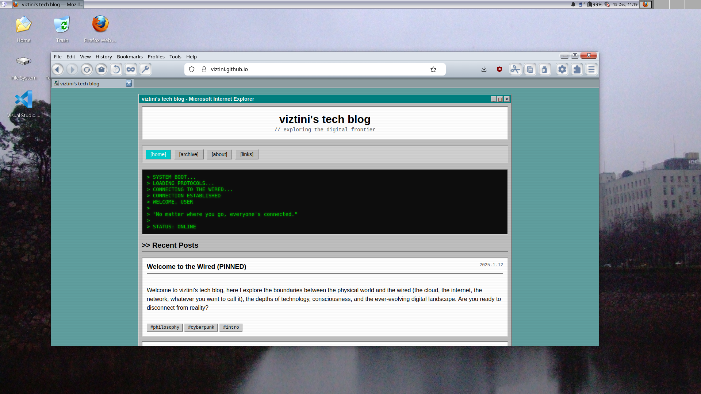

# Osaka ’09 — A Firefox CSS Theme

Firefox CSS Theme for retro Gentoo Linux distro, Osaka '09

This theme is built on top of three excellent community projects, remixing their ideas into something new while keeping the spirit of each:

- **[AeroFirefox](guide://action?prefill=Tell%20me%20more%20about%3A%20AeroFirefox)** — for its glassy translucency and polished Windows‑style chrome  
- **[RetroThemesFirefox](guide://action?prefill=Tell%20me%20more%20about%3A%20RetroThemesFirefox)** — for its dedication to nostalgic UI design  
- **[Modoki‑Firefox](guide://action?prefill=Tell%20me%20more%20about%3A%20Modoki%E2%80%91Firefox)** — for its clean structure and modular approach to styling  

---

## Features

- **[Late‑2000s aesthetic](guide://action?prefill=Tell%20me%20more%20about%3A%20Late%E2%80%912000s%20aesthetic)** with glossy surfaces, soft shadows, and subtle gradients  
- **[Custom tab styling](guide://action?prefill=Tell%20me%20more%20about%3A%20Custom%20tab%20styling)** inspired by Aero‑era window frames  
- **[Refined toolbar layout](guide://action?prefill=Tell%20me%20more%20about%3A%20Refined%20toolbar%20layout)** with retro spacing and icon proportions  
- **[Optional translucency effects](guide://action?prefill=Tell%20me%20more%20about%3A%20Optional%20translucency%20effects)** depending on your OS and Firefox setup  
- **[Lightweight CSS‑only implementation](guide://action?prefill=Tell%20me%20more%20about%3A%20Lightweight%20CSS%E2%80%91only%20implementation)** — no extensions required  

---

## Installation

1. **[Enable userChrome.css](guide://action?prefill=Tell%20me%20more%20about%3A%20Enable%20userChrome.css)** in Firefox  
   - Go to `about:config`  
   - Set `toolkit.legacyUserProfileCustomizations.stylesheets` to `true`  

2. **[Locate your profile folder](guide://action?prefill=Tell%20me%20more%20about%3A%20Locate%20your%20profile%20folder)**  
   - Open `about:support`  
   - Click “Profile Folder” → “Open Folder”  

3. **[Create a chrome folder](guide://action?prefill=Tell%20me%20more%20about%3A%20Create%20a%20chrome%20folder)** (if it doesn’t already exist)  
   - Inside your profile directory, create a folder named `chrome`  

4. **[Copy the theme files](guide://action?prefill=Tell%20me%20more%20about%3A%20Copy%20the%20theme%20files)**  
   - Place `userChrome.css` and any additional assets from this repo into the `chrome` folder  

5. **[Restart Firefox](guide://action?prefill=Tell%20me%20more%20about%3A%20Restart%20Firefox)** to apply the theme  

---

## Customization

Osaka ’09 is designed to be easily tweakable. You can adjust:

- **[Color accents](guide://action?prefill=Tell%20me%20more%20about%3A%20Color%20accents)**  
- **[Tab shapes](guide://action?prefill=Tell%20me%20more%20about%3A%20Tab%20shapes)**  
- **[Toolbar height](guide://action?prefill=Tell%20me%20more%20about%3A%20Toolbar%20height)**  
- **[Translucency levels](guide://action?prefill=Tell%20me%20more%20about%3A%20Translucency%20levels)**  

All major sections in the CSS are commented for quick editing.

---

## Credits

This project wouldn’t exist without the work of:

- **AeroFirefox** by SandTechStuff  
- **RetroThemesFirefox** by matthewmx86  
- **Modoki‑Firefox** by soup‑bowl  

Each provided inspiration, structure, or techniques that Osaka ’09 builds upon.

---

## License

Released under the **[MIT License](guide://action?prefill=Tell%20me%20more%20about%3A%20MIT%20License)** unless otherwise noted.
